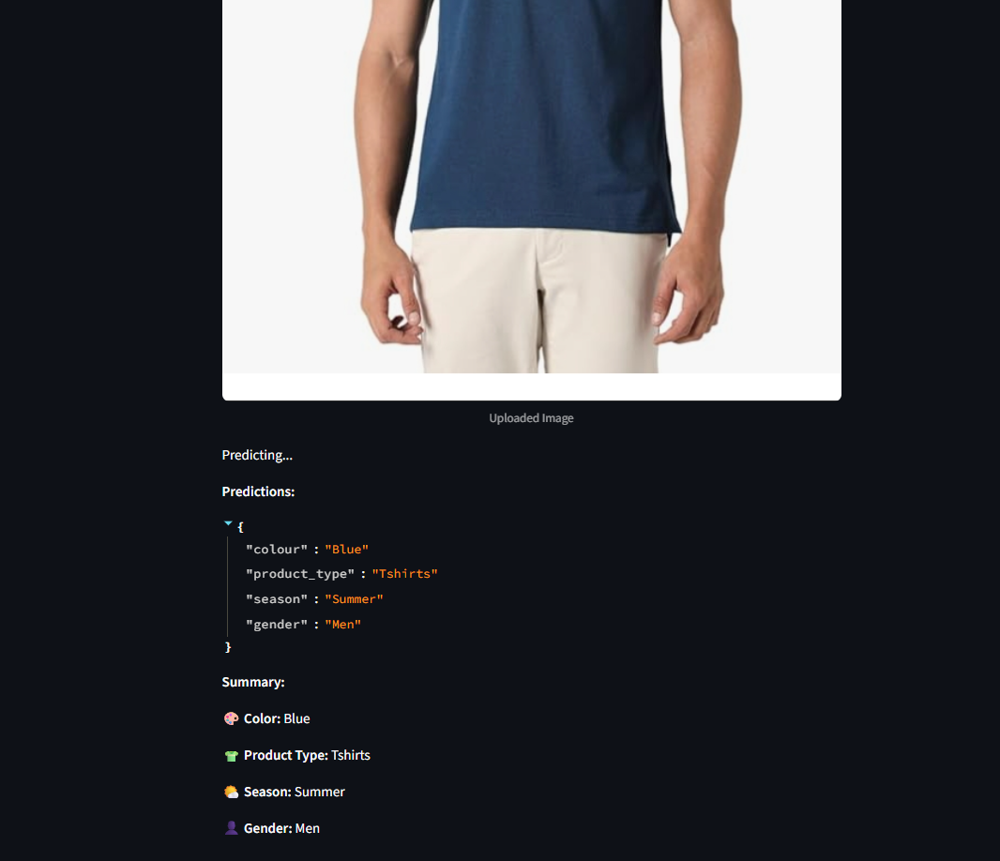
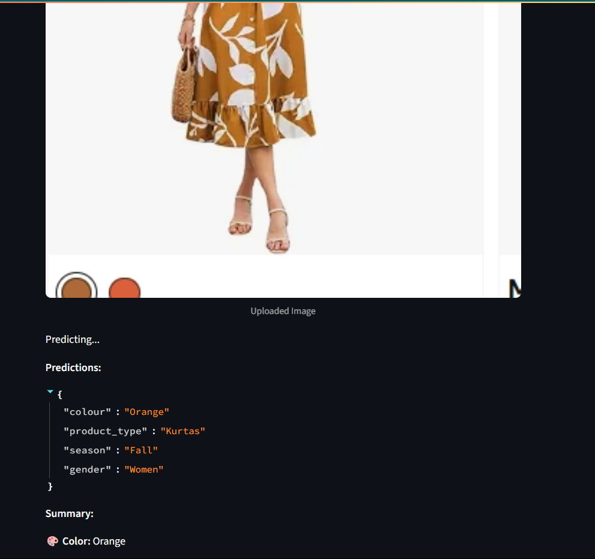
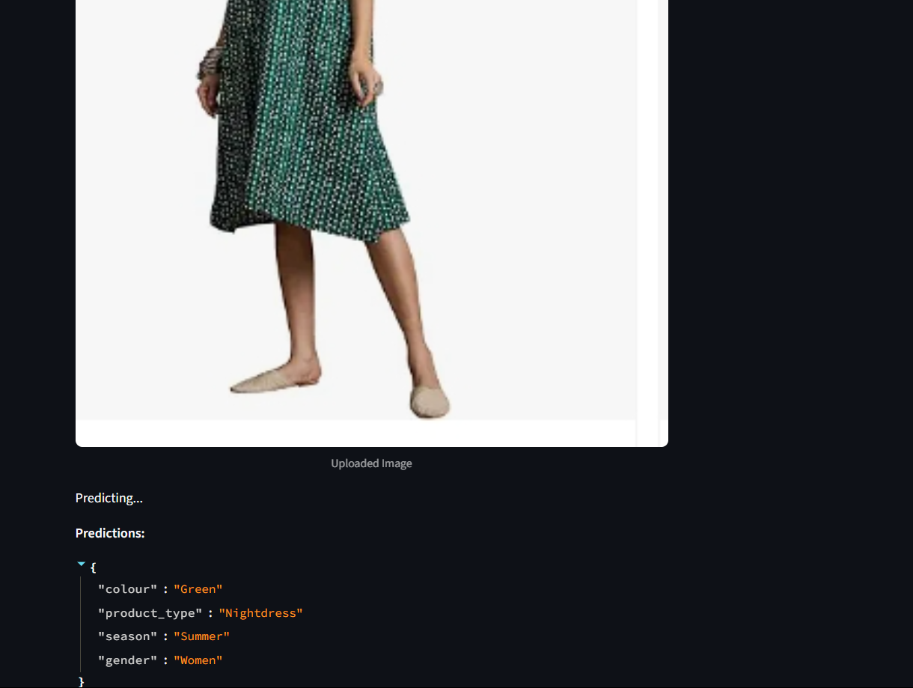

# Fashion Product Multi-Label Classification

## Overview
This project demonstrates multi-label classification of fashion product images using deep learning (ResNet50).  
The model predicts:
- **Color**
- **Product Type** (e.g., Tshirts, Shoes, etc.)
- **Season**
- **Gender**

## Features
- PyTorch-based multi-output model
- Trained on the Kaggle Fashion Product Images Dataset
- FastAPI endpoint for inference
- Streamlit GUI for demo

## Setup Instructions

This project provides a complete pipeline for fashion product classification using deep learning. It includes:
- Model training and evaluation (Jupyter notebook)
- FastAPI backend for model inference
- Streamlit frontend for interactive predictions
- Pre-trained model and encoders for immediate deployment

## 🚀 How to Run This Project

### 1. Clone the Repository
```sh
git clone https://github.com/Venkat499/Fashion_Product_Classification.git
cd Fashion_Product_Classification
```

### 2. Install Dependencies
Make sure you have Python 3.7+ installed.
```sh
pip install -r requirements.txt
```

### 3. Project Structure
- `API & Streamlit/` — Contains the API and Streamlit app scripts.
- `Jupyter File/` — Jupyter notebook for model training and exploration.
- `pkl file/` — Pre-trained model and label encoders.
- `Amazon sample/` — Sample images for testing.

### 4. Run the FastAPI Inference API
```sh
cd "API & Streamlit"
uvicorn api_inference:app --reload
```
- The API will be available at: [http://127.0.0.1:8000/docs](http://127.0.0.1:8000/docs)

### 5. Run the Streamlit App
```sh
cd "API & Streamlit"
streamlit run streamlit_app.py
```
- The web app will open in your browser.

### 6. (Optional) Explore the Jupyter Notebook
Open `Jupyter File/Fashion_Product_Classification.ipynb` in Jupyter Notebook or JupyterLab to see model training and analysis.

---

**Note:**
- Ensure the `.pth` and `.pkl` files in the `pkl file/` directory are present, as they are required for inference.
- If you have any issues, please check the Python version and that all dependencies are installed.

---

## Features
- Predicts product type, color, gender, and season from fashion images.
- Easy-to-use API and web interface.
- Visualization and analysis tools in the notebook.

---
- **Backbone:** ResNet50 (pretrained on ImageNet)
- **Image Size:** 224x224
- **Augmentation:** ColorJitter, RandomFlip, RandomRotation
- **Loss:** Weighted CrossEntropy (higher weight for color)
- **Framework:** PyTorch

## Dataset

- [Kaggle Fashion Product Images Dataset](https://www.kaggle.com/datasets/paramaggarwal/fashion-product-images-dataset)
- ~44,000 images with labels for color, product type, season, and gender

## Demo Results

Below are sample predictions from the Streamlit app using real Amazon fashion product images:

| Uploaded Image | Predicted Color | Predicted Product Type | Predicted Season | Predicted Gender |
|:--------------:|:---------------:|:---------------------:|:----------------:|:----------------:|
|  | Blue | Tshirts | Summer | Men |
|  | Orange | Kurtas | Fall | Women |
|  | Green | Nightdress | Summer | Women |

**JSON Output Example:**
```json
{
  "colour": "Blue",
  "product_type": "Tshirts",
  "season": "Summer",
  "gender": "Men"
}
```

**Summary Output Example:**
- 🎨 Color: Blue
- 👕 Product Type: Tshirts
- 🌤️ Season: Summer
- 👤 Gender: Men

## Author
[Dongala Venkatesh] - Codemonk ML Intern Assignment 
